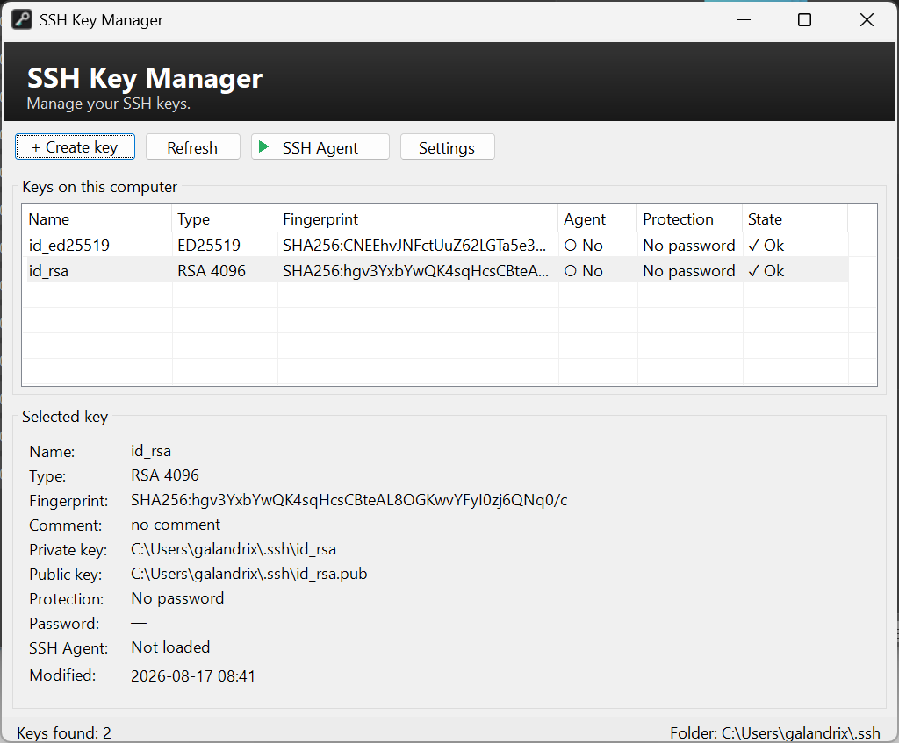

# SSH Key Manager

A small Windows manager for OpenSSH keys. It lists keys in `~\.ssh`, creates new ones, changes passphrases, and talks to the `ssh-agent` service.



## Requirements

- Windows 10/11
- [.NET 10 Desktop Runtime](https://dotnet.microsoft.com/download/dotnet/10.0)
- OpenSSH: `ssh-keygen`, `ssh-add`, and the `ssh-agent` service

## Run

`bin/SshKeyManager.exe`

The published build is a single file. It does not include the .NET runtime, so the Desktop Runtime above is still required.

## Build

```
dotnet publish src -c Release -r win-x64 -o bin
```

This produces one `bin/SshKeyManager.exe` (`PublishSingleFile`, framework-dependent).

## Features

- list keys from `~\.ssh`: type, fingerprint, agent, protection
- create ED25519 or RSA 4096
- change, remove, or generate a key passphrase
- start/stop the agent service, add/remove a key
- language: English / Russian (English by default)

Password generator settings: `%AppData%\SshKeyManager\settings.json`
